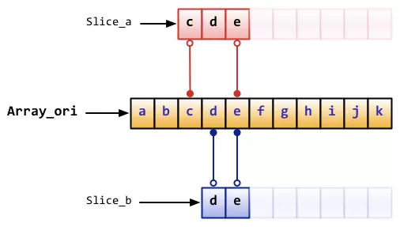

## 切片 `slice`
-其分身并不是数组，他指向底层的数组  
-作为变长数组的替代方案，可以关联底层数组的局部或全部  
-为引用类型  
-可以直接创建或从底层数组获取生成  
-使用 `len()` 获取元素个数， `cap()` 获取容量  
-一般使用 `make()` 创建  
-如果多个 `slice` 指向相同底层数组，其中一个的值改变会影响全部  
  
-`make([]T, len, cap)`  
-其中 `cap` 可以省略，则和 `len` 的值相同  
-`len` 表示存储的元素个数， `cap`表示容量  

    a := [10]int{1,2,3,4,5,6,7,8,9}
	fmt.Println(a)

    //取一个值
	sl := a[5]
	
    //截取索引5 到 索引9,不包含 10
    sl := a[5:10]

    //从 索引为3处 截取到尾部
    sl := a[3:]

    //从头取到索索引为 5
    sl := a[:5]

    //完全拷贝
    sl := a[:]

    //make创建 与len和cap相同时的简写
    sl := make([]int,3,3)
    sl := make([]int,3,)
    sl := make([]int,3)

	fmt.Println(sl)

## `slice` 与底层数组的对应关系

    Array_ori := []byte{'a', 'b', 'c', 'd', 'e', 'f', 'g', 'h', 'i', 'j', 'k'}
    Slice_a := Array_ori[2:5]
    fmt.Println(string(Slice_a))
    Slice_b := Array_ori[3:5]
    fmt.Println(string(Slice_b))

## `reslice`
-`reslice`时索引以被 `slice` 的切片为准   
-索引不可以超过被 `slice` 的切片的容量 `cap()`值  
-索引越界不会导致底层数组的重新分配而是引发错误  

## `append`
-可以在 `slice` 尾部追加元素  
-可以将一个 `slice` 追加在另一个 `slice` 尾部  
-如果最终长度未超过追加到 `slice` 的容量则返回原始 `slice`  
-如果超过追加到的 `slice` 的容量则重新分配数组并拷贝原始数据  

    a := make([]int, 3, 6)
	fmt.Printf("%p\n", a)
    //追加元素
	a = append(a, 1, 2, 3)
	fmt.Printf("%v %p\n", a, a)
    //超出容量，重新分配内存
	a = append(a, 1, 2, 3)
	fmt.Printf("%v %p\n", a, a)

## `copy`
    
    a := []int{1,2,3,4,5,6}
    b := []int{7,8,9}
	copy(a, b)
    //结果为 [7 8 9 4 5 6]
	fmt.Println(a)

    copy(a[1:3], b[0:2])
    //结果为 [1 7 8 4 5 6]
    fmt.Println(a)